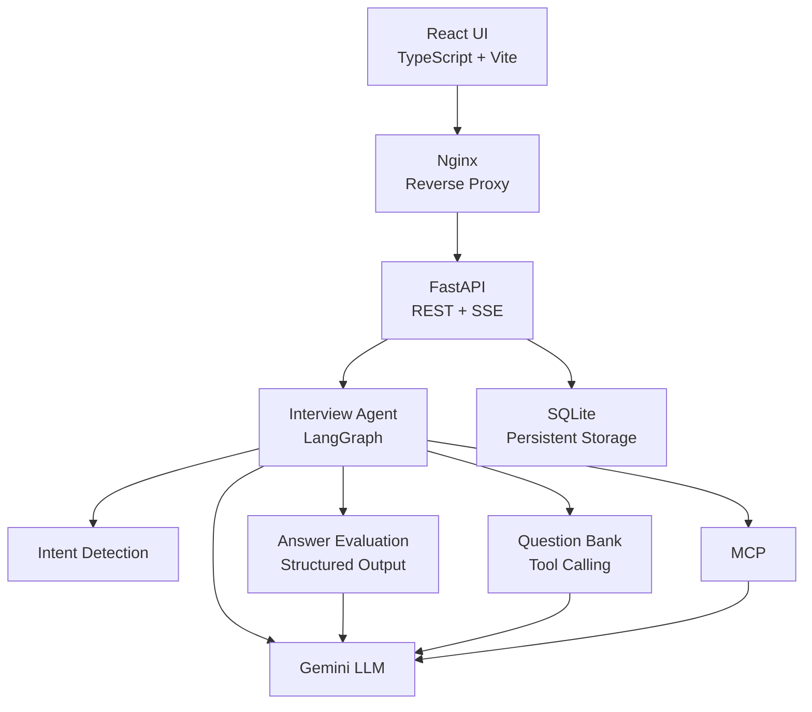
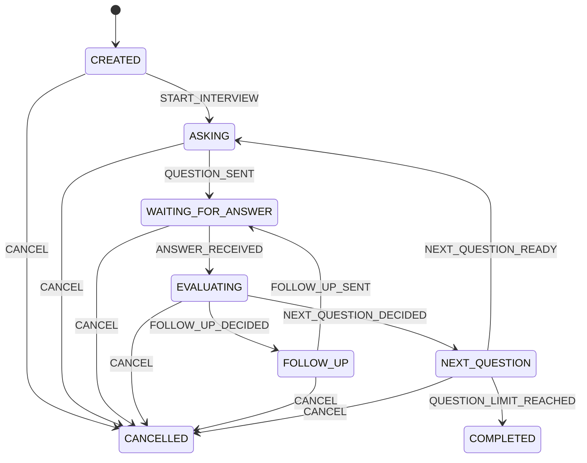
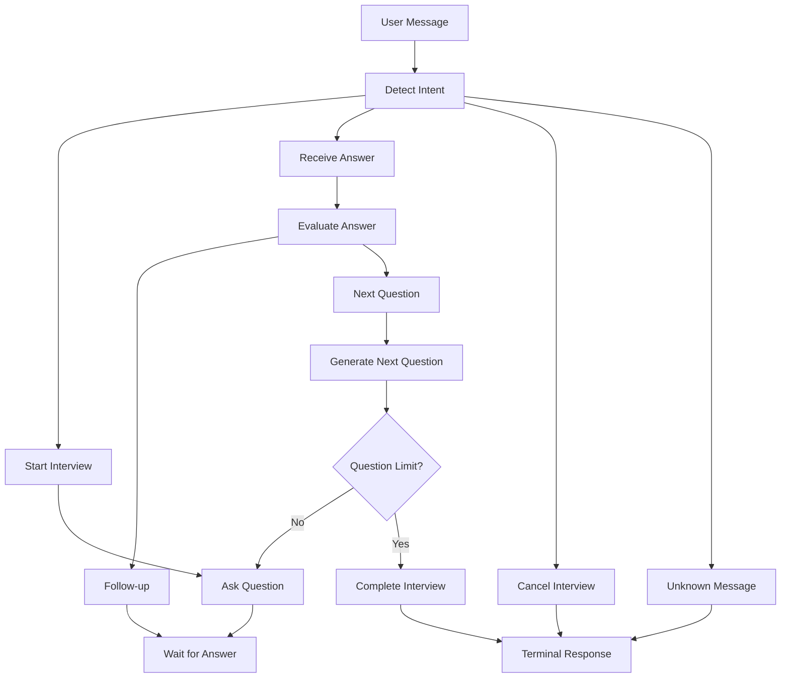

AI Interview Agent
An engineering-oriented AI technical interview simulator built with LangGraph, FastAPI, Gemini, React, SSE, MCP, Tool Calling, SQLite, and Docker.
AI Interview Agent is a full-stack AI application designed to simulate technical interviews for AI application engineering roles.
Instead of treating the system as a simple LLM chatbot, the project models an interview as a stateful workflow with explicit domain states, agent orchestration, structured evaluation, tool calling, persistence, streaming responses, and a web interface.
✨ Features
Interview Workflow
- Create an interview session
- Start a technical interview
- Ask AI engineering questions
- Receive candidate answers
- Evaluate answers with structured output
- Decide whether to ask a follow-up question
- Move to the next question
- Track question and follow-up counts
- Complete or cancel an interview
AI / Agent Capabilities
- LangGraph-based agent workflow
- Intent detection
- Structured answer evaluation
- Follow-up question generation
- Question Bank tool
- Tool Calling
- MCP integration
- Gemini LLM integration
- Streaming LLM responses
Backend
- FastAPI
- REST API
- Server-Sent Events (SSE)
- SQLite persistence
- Session recovery
- Exception handling
- Repository pattern
- Pydantic models
Frontend
- React
- TypeScript
- Vite
- Real-time SSE streaming
- Interview session UI
- Conversation history
- Interview status display
Deployment
- Docker
- Docker Compose
- Multi-stage frontend build
- Nginx reverse proxy
- Persistent SQLite volume
- Backend / frontend container separation
🏗️ Architecture

The system separates the application into several layers:
Frontend
    ↓
Nginx
    ↓
FastAPI
    ↓
Interview Agent
    ↓
LangGraph
    ↓
LLM / Structured Output / Tools / MCP
    ↓
SQLite
This separation keeps domain logic, agent orchestration, infrastructure, and presentation concerns independent.
🔄 Interview State Machine
The interview is modeled as an explicit state machine rather than a collection of loosely connected LLM calls.

Core interview states include:
- CREATED
- ASKING
- WAITING_FOR_ANSWER
- EVALUATING
- FOLLOW_UP
- NEXT_QUESTION
- COMPLETED
- CANCELLED
The state machine makes interview transitions explicit and testable.
🤖 Agent Workflow
The LangGraph workflow coordinates the interview process.

LangGraph is responsible for orchestration, while the domain state machine defines the valid interview transitions.
This separation allows the project to combine:
- deterministic domain rules
- graph-based orchestration
- LLM reasoning
- tool execution
- persistent session state
🧠 Structured Output
Answer evaluation uses structured LLM output instead of relying on free-form text parsing.
The evaluator produces information such as:
decision
score
reason
missing_points
Example conceptual output:
{
  "decision": "follow_up",
  "score": 7,
  "reason": "The answer demonstrates the basic concept but lacks implementation details.",
  "missing_points": [
    "retrieval strategy",
    "chunking considerations"
  ]
}
This makes the evaluation result directly usable by the agent workflow.
The decision determines whether the interview should:
evaluate answer
      ↓
 ┌───────────────┐
 │               │
follow_up    next_question
 │               │
 ↓               ↓
Follow-up     Next Question
🛠️ Tool Calling
The agent can use a Question Bank tool to retrieve interview questions.
The tool is responsible for selecting questions while considering previously asked questions.
Conceptually:
Interview Agent
      ↓
Question Bank Tool
      ↓
Question Selection
      ↓
Next Interview Question
This demonstrates how an LLM agent can combine reasoning with deterministic application tools instead of generating every piece of information directly.
🔌 MCP
The project also includes an MCP client/server implementation for practicing the Model Context Protocol.
The MCP layer demonstrates how external capabilities can be exposed as tools that an agent can interact with.
This provides hands-on experience with:
- MCP client/server architecture
- tool discovery
- tool invocation
- agent-to-tool interaction
🌊 Streaming
The backend supports Server-Sent Events (SSE) for real-time responses.
React
  │
  │ POST /sessions/{id}/messages/stream
  ▼
FastAPI
  │
  ▼
Interview Agent
  │
  ▼
LLM Streaming
  │
  │ token
  │ token
  │ token
  ▼
SSE
  │
  ▼
React UI
Instead of waiting for the entire LLM response, the frontend receives generated content incrementally.
The streaming pipeline is implemented across:
- Gemini streaming
- Agent streaming
- FastAPI SSE
- React SSE parsing
💾 Persistence
Interview sessions are persisted with SQLite.
Persistent information includes:
- session ID
- interview status
- target question count
- question count
- current question
- current answer
- follow-up count
- interview history
- latest evaluation
The application uses a repository layer to separate persistence logic from the rest of the application.
FastAPI
   ↓
Repository
   ↓
SQLAlchemy
   ↓
SQLite
This also allows an interview session to be recovered after the application process restarts.
🔌 API
Health Check
GET /health
Example response:
{
  "status": "ok"
}
Create Interview Session
POST /sessions
Example request:
{
  "target_question_count": 5
}
Get Interview Session
GET /sessions/{session_id}
Send Message
POST /sessions/{session_id}/messages
Send Streaming Message
POST /sessions/{session_id}/messages/stream
The streaming endpoint returns Server-Sent Events.
🖥️ Frontend
The frontend is implemented with:
- React
- TypeScript
- Vite
- SSE
The frontend communicates with the backend through the /api path.
In the Docker environment:
Browser
   ↓
Nginx :80
   ↓
FastAPI :8000
Nginx acts as the reverse proxy between the browser and backend container.
🐳 Docker
The project provides Docker configuration for both backend and frontend.
Backend
The backend image uses:
Python 3.12
FastAPI
Uvicorn
Frontend
The frontend uses a multi-stage Docker build:
Node.js
   ↓
npm build
   ↓
Static files
   ↓
Nginx
Docker Compose
The complete application can be started with:
docker compose up --build
The architecture is:
┌──────────────────────────────┐
│          Browser             │
└──────────────┬───────────────┘
               │
               ▼
┌──────────────────────────────┐
│       Frontend Container     │
│            Nginx             │
│             :80              │
└──────────────┬───────────────┘
               │
               │ /api
               ▼
┌──────────────────────────────┐
│       Backend Container      │
│          FastAPI             │
│            :8000             │
└──────────────┬───────────────┘
               │
               ▼
┌──────────────────────────────┐
│            SQLite            │
│       Persistent Volume      │
└──────────────────────────────┘
🚀 Local Development
Backend
Create and activate a Python virtual environment:
python -m venv .venv
Windows:
.venv\Scripts\activate
Install dependencies:
pip install -r requirements.txt
Configure environment variables in .env.
Start the backend:
uvicorn app.main:app --reload
The backend will be available at:
http://localhost:8000
Frontend
Navigate to the frontend directory:
cd frontend
Install dependencies:
npm install
Start the development server:
npm run dev
The frontend will normally be available at:
http://localhost:5173
🧪 Testing
The project includes unit and integration tests covering areas such as:
- Domain state machine
- Interview session
- Agent behavior
- API
- Persistence
- Repository
- Structured output
- Gemini client
- Streaming
- Tool Calling
Run the non-integration test suite with:
python -m pytest -m "not integration"
Integration tests that depend on external LLM services may require valid API credentials and available model quota.
📁 Project Structure
AI-Interview-Agent/
│
├── app/
│   ├── agent/
│   │   ├── evaluator.py
│   │   ├── intent_detector.py
│   │   ├── interview_agent.py
│   │   ├── models.py
│   │   └── response_generator.py
│   │
│   ├── db/
│   │   ├── database.py
│   │   ├── models.py
│   │   ├── repository.py
│   │   └── init_db.py
│   │
│   ├── domain/
│   │   ├── events.py
│   │   ├── session.py
│   │   ├── state_machine.py
│   │   └── states.py
│   │
│   ├── graph/
│   │   ├── graph.py
│   │   ├── nodes.py
│   │   └── state.py
│   │
│   ├── llm/
│   │   ├── base.py
│   │   ├── fake.py
│   │   └── gemini_client.py
│   │
│   ├── mcp_client/
│   │   └── client.py
│   │
│   ├── mcp_server/
│   │   └── server.py
│   │
│   ├── tools/
│   │   ├── question_tool.py
│   │   ├── registry.py
│   │   └── tools.py
│   │
│   └── main.py
│
├── frontend/
│   ├── src/
│   │   ├── App.tsx
│   │   ├── App.css
│   │   ├── index.css
│   │   └── main.tsx
│   ├── Dockerfile
│   ├── nginx.conf
│   ├── package.json
│   └── vite.config.ts
│
├── tests/
│
├── docs/
│   └── image/
│
├── Dockerfile
├── docker-compose.yml
├── requirements.txt
├── README.md
├── README.zh-CN.md
└── .dockerignore
🧰 Tech Stack
Category	Technology
Language	Python, TypeScript
Backend	FastAPI
Agent Framework	LangGraph
LLM	Google Gemini
Structured Output	Pydantic
Tool Calling	Gemini Tool Calling
Protocol	MCP
Streaming	Server-Sent Events
Frontend	React
Frontend Tooling	Vite
Database	SQLite
ORM	SQLAlchemy
Containerization	Docker
Reverse Proxy	Nginx
Testing	Pytest

🎯 Engineering Highlights
This project focuses on AI application engineering rather than simply calling an LLM API.
1. Explicit Domain Modeling
Interview states and events are modeled explicitly, making the core workflow deterministic and testable.
2. Agent Orchestration
LangGraph manages the execution flow between intent detection, evaluation, follow-up generation, question generation, completion, and cancellation.
3. Structured LLM Output
Pydantic models provide a typed boundary between LLM responses and application logic.
4. Tool-Augmented Agent
The Question Bank is exposed as a callable tool instead of embedding all question-selection logic inside prompts.
5. MCP Practice
The project contains an MCP client/server implementation to explore standardized tool integration.
6. Real-Time Streaming
The complete streaming path works from the LLM through the agent and FastAPI SSE endpoint to the React frontend.
7. Persistence and Recovery
Interview sessions survive application restarts through SQLite persistence.
8. Containerized Deployment
Frontend and backend are separated into containers and connected through Nginx and Docker Compose.
📈 Development Roadmap
The project was developed through the following engineering phases:
- Phase 0 — Business Modeling / Interview Session / State Machine
- Phase 1 — Domain Core
- Phase 2 — Agent Runtime
- Phase 3 — Real LLM + Structured Output
- Phase 4 — FastAPI + Streaming + Session API
- Phase 5 — Persistence + Session Recovery + Exception Handling
- Phase 6 — LangGraph + MCP + Tool Calling
- Phase 7 — Frontend + Docker + Deployment + GitHub/README Packaging
All planned phases are currently completed.
🔮 Future Improvements
Potential future extensions include:
- Authentication and user accounts
- PostgreSQL production database
- Redis-based session management
- More advanced interview scoring
- Resume-aware interview generation
- Difficulty adaptation based on candidate performance
- Interview report generation
- Observability and tracing
- Production cloud deployment
- CI/CD pipeline
- More MCP-based external tools
📌 Project Status
Completed — Phase 0 through Phase 7
The project currently provides a complete full-stack AI interview simulation system with:
Domain Modeling
      +
State Machine
      +
LLM
      +
Structured Output
      +
LangGraph
      +
Tool Calling
      +
MCP
      +
SSE Streaming
      +
Persistence
      +
React
      +
Docker
The project is designed as an engineering-oriented portfolio project for learning and demonstrating AI application development, backend engineering, agent orchestration, and LLM integration.
📄 License
MIT License