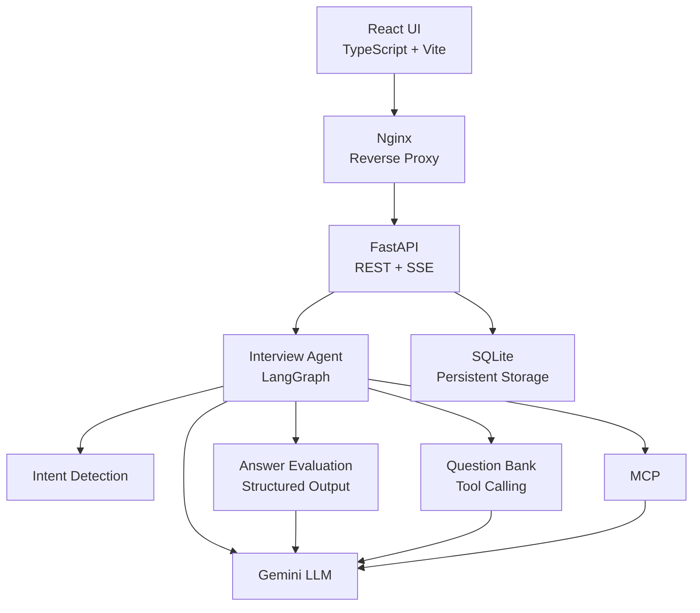
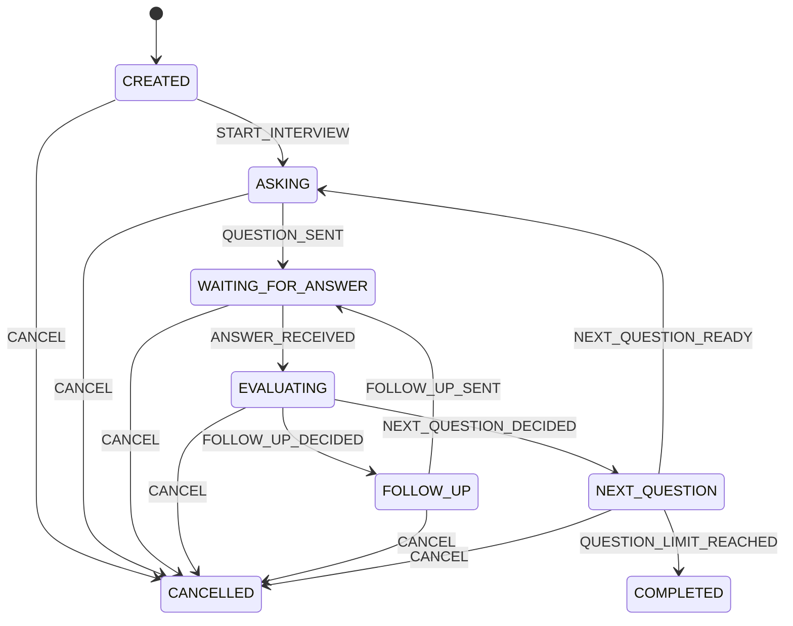
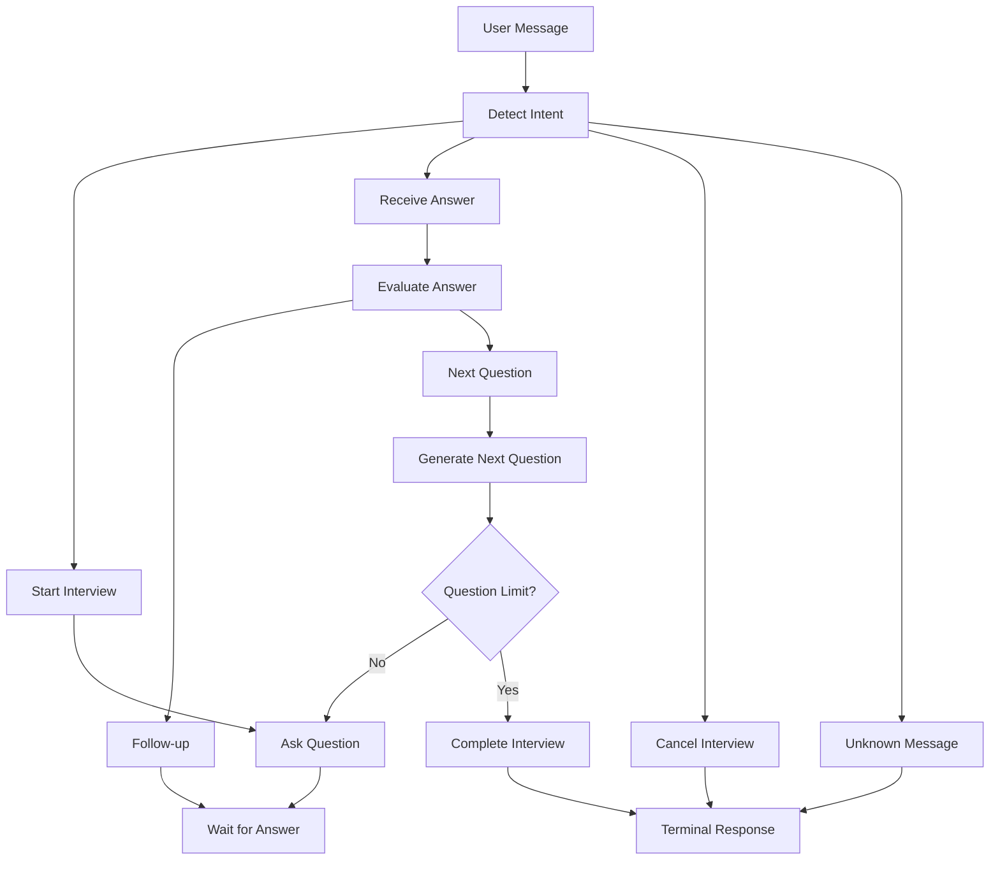
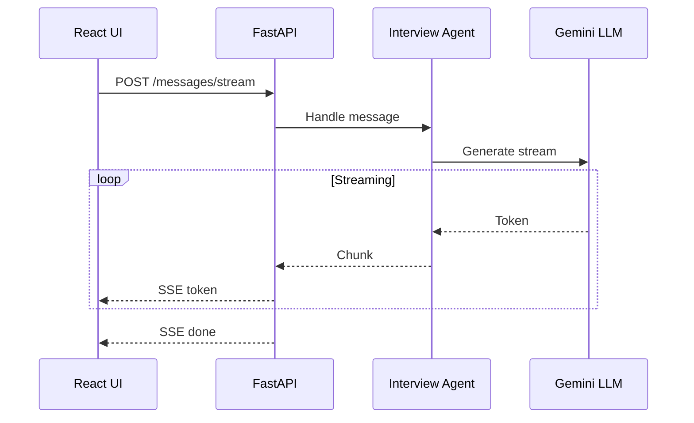
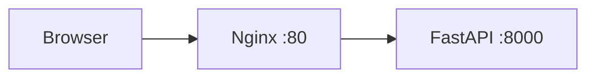
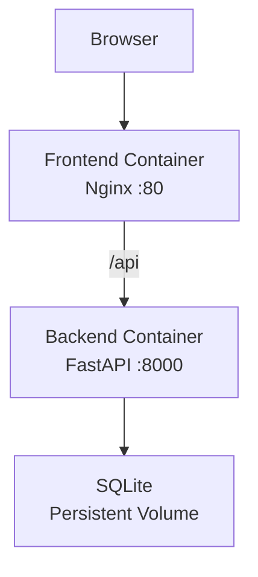

# AI Interview Agent

一个面向工程实践的 AI 技术面试模拟器，基于 **LangGraph、FastAPI、Gemini、React、SSE、MCP、Tool Calling、SQLite 和 Docker** 构建。

AI Interview Agent 是一个全栈 AI 应用，旨在模拟 AI 应用工程岗位的技术面试。

本项目并不把系统简单地视为一个 LLM 聊天机器人，而是将面试建模为一个**有状态的工作流**，包含明确的领域状态、Agent 编排、结构化评估、工具调用、持久化、流式响应和 Web 界面。

## ✨ 功能特性

### 面试工作流

- 创建面试会话
- 开始技术面试
- 提出 AI 工程相关问题
- 接收候选人的回答
- 使用结构化输出评估回答
- 决定是否提出追问
- 进入下一道问题
- 跟踪问题数量和追问次数
- 完成或取消面试

### AI / Agent 能力

- 基于 LangGraph 的 Agent 工作流
- 意图检测
- 结构化回答评估
- 追问生成
- 题库工具
- 工具调用
- MCP 集成
- Gemini LLM 集成
- LLM 流式响应

### 后端

- FastAPI
- REST API
- Server-Sent Events（SSE）
- SQLite 持久化
- 会话恢复
- 异常处理
- Repository 模式
- Pydantic 模型

### 前端

- React
- TypeScript
- Vite
- 实时 SSE 流式传输
- 面试会话界面
- 对话历史
- 面试状态显示

### 部署

- Docker
- Docker Compose
- 前端多阶段构建
- Nginx 反向代理
- 持久化 SQLite 数据卷
- 后端 / 前端容器分离

---

## 🏗️ 系统架构



系统由以下几个层次组成：

```text
Frontend
   ↓
Nginx
   ↓
FastAPI
   ↓
Interview Agent
   ↓
LangGraph
   ↓
LLM / Structured Output / Tools / MCP
   ↓
SQLite
```

这种分层使领域逻辑、Agent 编排、基础设施和表现层关注点保持相对独立。
🔄 面试状态机
面试生命周期被建模为一个明确的状态机，而不是一组松散连接的 LLM 调用。

核心面试状态：
- CREATED
- ASKING
- WAITING_FOR_ANSWER
- EVALUATING
- FOLLOW_UP
- NEXT_QUESTION
- COMPLETED
- CANCELLED
状态机使面试状态转换明确且可测试。
🤖 Agent 工作流
LangGraph 负责协调面试的执行流程。

LangGraph 负责 Agent 编排，而领域状态机定义有效的面试状态转换。
这使项目能够结合：
- 确定性的领域规则
- 基于图的工作流编排
- LLM 推理
- 工具执行
- 持久化会话状态
🧠 结构化输出
回答评估使用结构化的 LLM 输出，而不是依赖自由文本解析。
评估器会生成：
decision
score
reason
missing_points
示例：

```json
{
  "decision": "follow_up",
  "score": 7,
  "reason": "The answer demonstrates the basic concept but lacks implementation details.",
  "missing_points": [
    "retrieval strategy",
    "chunking considerations"
  ]
}
```

随后，Agent 工作流会使用结构化评估结果来决定下一步操作。

概念上：

```text
Evaluate Answer
       ↓
   Decision
    ↙     ↘
Follow-up  Next Question
```
🛠️ 工具调用
Agent 可以使用 Question Bank Tool 获取面试题目。
Question Bank 在选择下一道题时会考虑之前已经提问过的问题。
整体流程如下：

```text
Interview Agent
      ↓
Question Bank Tool
      ↓
Question Selection
      ↓
Next Interview Question
```

这展示了 LLM Agent 如何将推理能力与确定性的应用工具结合起来，而不是把所有选题逻辑都放进 Prompt 中。
🔌 MCP
项目包含一个 MCP 客户端/服务端实现，用于实践 Model Context Protocol。
MCP 层展示了如何将外部能力以工具的形式暴露出来，并让 Agent 与这些工具进行交互。
实践内容包括：
- MCP 客户端/服务端架构
- 工具发现
- 工具调用
- Agent 与工具之间的交互
🌊 流式传输
后端支持使用 Server-Sent Events（SSE）实现实时响应。

完整的流式传输链路包括：
- Gemini 流式生成
- Agent 流式传输
- FastAPI SSE
- React SSE 解析
因此，用户可以逐步接收生成内容，而不需要等待完整响应生成完毕。
💾 持久化
面试会话使用 SQLite 进行持久化。
持久化的信息包括：
- Session ID
- 面试状态
- 目标问题数量
- 问题数量
- 当前问题
- 当前回答
- 追问次数
- 面试历史
- 最新评估结果
应用使用 Repository Layer 将持久化逻辑与应用其他部分分离。

```text
FastAPI
   ↓
Repository
   ↓
SQLAlchemy
   ↓
SQLite
```

这样即使应用进程重启，也可以恢复之前的面试会话。
🔌 API
健康检查
GET /health
示例响应：
{
  "status": "ok"
}
创建面试会话
POST /sessions
示例请求：
{
  "target_question_count": 5
}
获取面试会话
GET /sessions/{session_id}
发送消息
POST /sessions/{session_id}/messages
发送流式消息
POST /sessions/{session_id}/messages/stream
流式接口返回 Server-Sent Events。
🖥️ 前端
前端使用以下技术实现：
- React
- TypeScript
- Vite
- SSE
前端通过 `/api` 路径与后端通信。
在 Docker 环境中，Nginx 作为浏览器与后端容器之间的反向代理。

🐳 Docker
项目为后端和前端都提供了 Docker 配置。
后端
后端镜像使用：
- Python 3.12
- FastAPI
- Uvicorn
前端
前端采用多阶段 Docker 构建：
Node.js
   ↓
npm build
   ↓
Static Files
   ↓
Nginx
Docker Compose
可以使用以下命令启动完整应用：
docker compose up --build
容器架构：

🚀 本地开发
后端
创建 Python 虚拟环境：
python -m venv .venv
Windows：
.venv\Scripts\activate
安装依赖：
pip install -r requirements.txt
在 `.env` 中配置环境变量。
启动后端：
uvicorn app.main:app --reload
后端可通过以下地址访问：
http://localhost:8000
前端
进入前端目录：
cd frontend
安装依赖：
npm install
启动开发服务器：
npm run dev
前端通常可通过以下地址访问：
http://localhost:5173
🧪 测试
项目包含单元测试和集成测试，覆盖以下方面：
- 领域状态机
- 面试会话
- Agent 行为
- API
- 持久化
- Repository
- 结构化输出
- Gemini 客户端
- 流式传输
- 工具调用
运行非集成测试套件：
python -m pytest -m "not integration"
依赖外部 LLM 服务的集成测试可能需要有效的 API 凭证以及可用的模型配额。
## 📁 项目结构

```text
AI-Interview-Agent/
├── app/
│   ├── agent/
│   │   ├── evaluator.py
│   │   ├── intent_detector.py
│   │   ├── interview_agent.py
│   │   ├── models.py
│   │   └── response_generator.py
│   │
│   ├── db/
│   │   ├── database.py
│   │   ├── models.py
│   │   ├── repository.py
│   │   └── init_db.py
│   │
│   ├── domain/
│   │   ├── events.py
│   │   ├── session.py
│   │   ├── state_machine.py
│   │   └── states.py
│   │
│   ├── graph/
│   │   ├── graph.py
│   │   ├── nodes.py
│   │   └── state.py
│   │
│   ├── llm/
│   │   ├── base.py
│   │   ├── fake.py
│   │   └── gemini_client.py
│   │
│   ├── mcp_client/
│   │   └── client.py
│   │
│   ├── mcp_server/
│   │   └── server.py
│   │
│   ├── tools/
│   │   ├── question_tool.py
│   │   ├── registry.py
│   │   └── tools.py
│   │
│   └── main.py
│
├── frontend/
│   ├── src/
│   │   ├── App.tsx
│   │   ├── App.css
│   │   ├── index.css
│   │   └── main.tsx
│   ├── Dockerfile
│   ├── nginx.conf
│   ├── package.json
│   └── vite.config.ts
│
├── tests/
├── docs/
│   └── image/
│
├── Dockerfile
├── docker-compose.yml
├── requirements.txt
├── README.md
├── README.zh-CN.md
└── .dockerignore
```
🧰 技术栈
## 🧰 技术栈

| 类别 | 技术 |
|---|---|
| 语言 | Python、TypeScript |
| 后端 | FastAPI |
| Agent 框架 | LangGraph |
| LLM | Google Gemini |
| 结构化输出 | Pydantic |
| 工具调用 | Gemini Tool Calling |
| 协议 | MCP |
| 流式传输 | Server-Sent Events |
| 前端 | React |
| 前端 Tooling | Vite |
| 数据库 | SQLite |
| ORM | SQLAlchemy |
| 容器化 | Docker |
| 反向代理 | Nginx |
| 测试 | Pytest |

🎯 工程亮点
本项目关注的是 AI 应用工程，而不仅仅是调用 LLM API。
1. 显式领域建模
面试状态和事件被显式建模，使核心工作流具备确定性且可测试。
2. Agent 编排
LangGraph 管理意图检测、评估、追问生成、问题生成、完成和取消之间的执行流程。
3. 结构化 LLM 输出
Pydantic 模型在 LLM 响应与应用逻辑之间提供了类型化边界。
4. 工具增强型 Agent
Question Bank 被暴露为可调用工具，而不是将所有选题逻辑嵌入 Prompt。
5. MCP 实践
项目包含 MCP 客户端/服务端实现，用于探索标准化工具集成。
6. 实时流式传输
完整的流式链路从 LLM 经过 Agent、FastAPI SSE 接口，最终到达 React 前端。
7. 持久化与恢复
通过 SQLite 持久化，即使应用重启，面试会话仍然可以保留。
8. 容器化部署
前端 and backend are separated into containers and connected through Nginx and Docker Compose.
📈 开发路线
本项目按照以下工程阶段进行开发：
- Phase 0 — 业务建模 / 面试会话 / 状态机
- Phase 1 — 领域核心
- Phase 2 — Agent 运行时
- Phase 3 — 真实 LLM + 结构化输出
- Phase 4 — FastAPI + 流式传输 + 会话 API
- Phase 5 — 持久化 + 会话恢复 + 异常处理
- Phase 6 — LangGraph + MCP + Tool Calling
- Phase 7 — 前端 + Docker + Deployment + GitHub/README Packaging
目前所有计划中的阶段均已完成。
🔮 后续改进方向
未来可以进一步扩展：
- 身份认证和用户账户
- PostgreSQL 生产数据库
- 基于 Redis 的会话管理
- 更高级的面试评分
- 基于简历生成面试内容
- 根据候选人表现动态调整难度
- 面试报告生成
- 可观测性与链路追踪
- 生产环境云部署
- CI/CD 流水线
- 更多基于 MCP 的外部工具
## 📌 项目状态

**已完成 — Phase 0 至 Phase 7**

目前项目已经提供一个完整的全栈 AI 面试模拟系统，包含：

- 领域建模
- 状态机
- LLM 集成
- 结构化输出
- LangGraph
- 工具调用
- MCP
- SSE 流式传输
- 持久化
- React
- Docker

本项目定位为一个面向工程实践的作品集项目，用于学习和展示：

- AI 应用开发
- 后端 engineering
- LLM 集成
- Agent 编排
- 结构化输出
- 工具调用
- MCP
- 流式传输 architecture
- 容器化部署