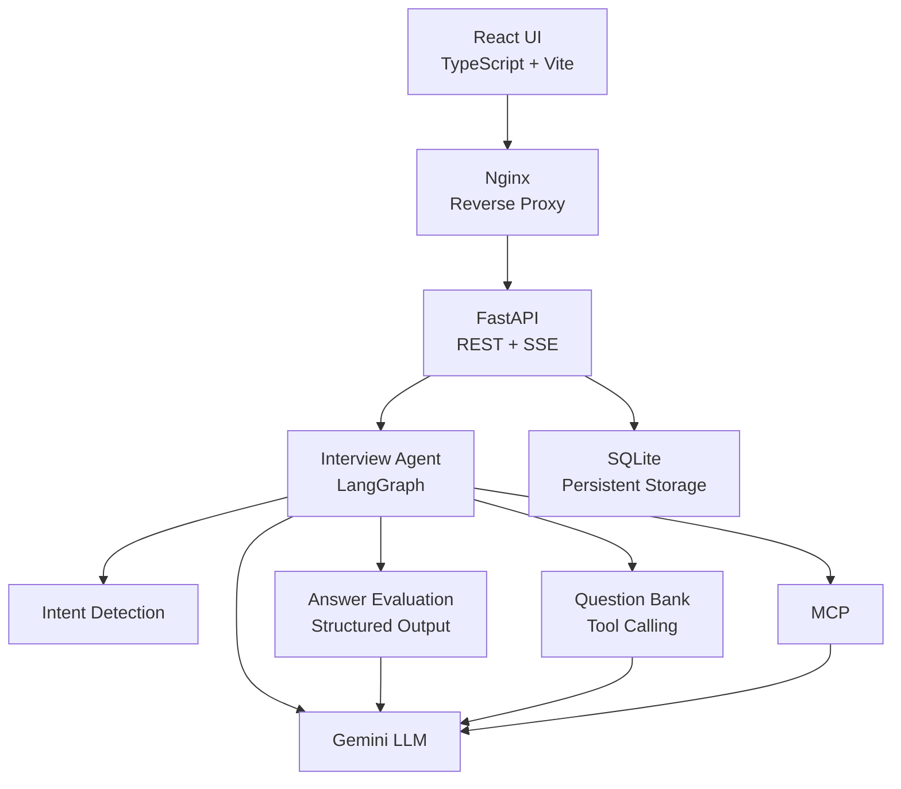
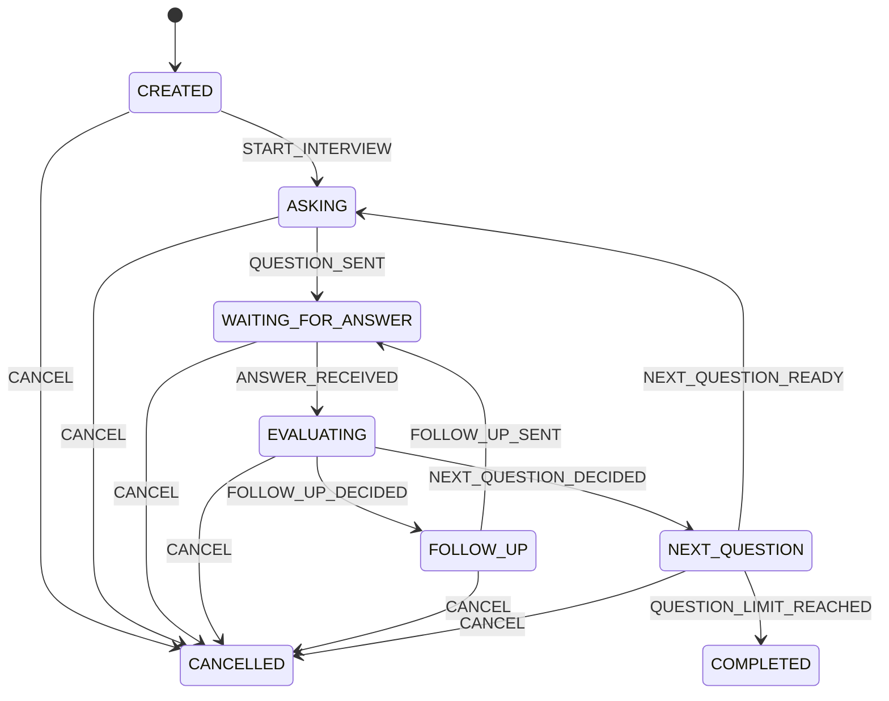
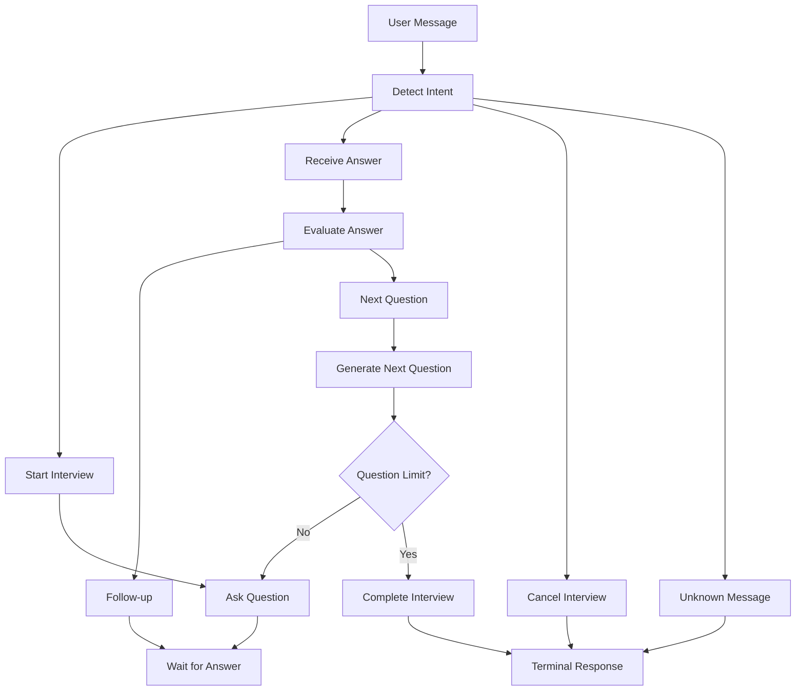

AI Interview Agent
一个面向工程实践的 AI 技术面试模拟系统，基于 LangGraph、FastAPI、Gemini、React、SSE、MCP、Tool Calling、SQLite 和 Docker 构建。
AI Interview Agent 是一个全栈 AI 应用，目标是模拟面向 AI 应用开发岗位的技术面试。
本项目并不是简单地实现一个 LLM Chatbot，而是将一次面试建模为一个具有明确状态、事件、Agent 编排、结构化评估、工具调用、持久化、流式响应和 Web UI 的有状态工作流系统。
✨ 核心功能
面试流程
- 创建面试 Session
- 开始技术面试
- AI 提出技术问题
- 接收候选人回答
- 使用结构化输出评估回答
- 根据回答决定是否追问
- 进入下一道问题
- 记录问题数量和追问数量
- 完成或取消面试
AI / Agent 能力
- 基于 LangGraph 的 Agent 工作流
- Intent Detection
- Structured Answer Evaluation
- Follow-up Question Generation
- Question Bank Tool
- Tool Calling
- MCP 集成
- Gemini LLM 集成
- LLM Streaming
Backend
- FastAPI
- REST API
- Server-Sent Events（SSE）
- SQLite 持久化
- Session Recovery
- Exception Handling
- Repository Pattern
- Pydantic Models
Frontend
- React
- TypeScript
- Vite
- SSE 实时流式响应
- 面试 Session UI
- 对话历史
- 面试状态显示
Deployment
- Docker
- Docker Compose
- Frontend Multi-stage Build
- Nginx Reverse Proxy
- SQLite Persistent Volume
- 前后端容器分离
🏗️ 系统架构

系统主要分为以下几个层次：
Frontend
    ↓
Nginx
    ↓
FastAPI
    ↓
Interview Agent
    ↓
LangGraph
    ↓
LLM / Structured Output / Tools / MCP
    ↓
SQLite
这种分层方式使 Domain Logic、Agent Orchestration、Infrastructure 和 UI 之间保持相对独立。
🔄 面试状态机
项目使用显式状态机对面试生命周期进行建模，而不是通过多个松散的 LLM 调用来控制流程。

核心面试状态包括：
- CREATED
- ASKING
- WAITING_FOR_ANSWER
- EVALUATING
- FOLLOW_UP
- NEXT_QUESTION
- COMPLETED
- CANCELLED
状态机使面试流程中的状态转换变得明确、可测试。
🤖 Agent 工作流
LangGraph 负责协调整个面试过程。

LangGraph 负责 Agent 的执行编排，而 Domain State Machine 负责定义合法的面试状态转换。
因此项目能够结合：
- 确定性的 Domain Rules
- Graph-based Orchestration
- LLM Reasoning
- Tool Execution
- Persistent Session State
🧠 Structured Output
回答评估并不是让 LLM 返回一段无法直接使用的自然语言，而是使用结构化输出得到明确的数据结构。
Evaluator 会产生：
decision
score
reason
missing_points
例如：
{
  "decision": "follow_up",
  "score": 7,
  "reason": "回答体现了基本概念，但缺少具体实现细节。",
  "missing_points": [
    "retrieval strategy",
    "chunking considerations"
  ]
}
这样可以直接将 LLM 的评估结果交给 Agent Workflow 使用。
评估结果最终决定：
Evaluate Answer
      ↓
 ┌───────────────┐
 │               │
Follow-up    Next Question
 │               │
 ↓               ↓
追问             下一题
🛠️ Tool Calling
Agent 可以通过 Question Bank Tool 获取面试问题。
Question Bank 负责根据已经询问过的问题进行问题选择，并避免重复问题。
整体流程：
Interview Agent
      ↓
Question Bank Tool
      ↓
Question Selection
      ↓
Next Interview Question
这体现了 Agent 如何将 LLM Reasoning 与确定性的 Application Tool 结合，而不是把所有问题选择逻辑都放在 Prompt 中。
🔌 MCP
项目包含 MCP Client / Server 实现，用于实践 Model Context Protocol。
MCP 层用于探索标准化的工具集成方式，使 Agent 可以通过统一协议与外部能力进行交互。
主要实践内容包括：
- MCP Client / Server Architecture
- Tool Discovery
- Tool Invocation
- Agent-to-Tool Interaction
🌊 Streaming
Backend 支持基于 Server-Sent Events（SSE）的实时流式响应。
React
  │
  │ POST /sessions/{id}/messages/stream
  ▼
FastAPI
  │
  ▼
Interview Agent
  │
  ▼
LLM Streaming
  │
  │ token
  │ token
  │ token
  ▼
SSE
  │
  ▼
React UI
用户不需要等待完整 LLM 响应生成之后才看到内容，而是可以持续接收生成结果。
完整 Streaming Pipeline 包括：
- Gemini Streaming
- Agent Streaming
- FastAPI SSE
- React SSE Parsing
💾 Persistence
面试 Session 使用 SQLite 进行持久化。
持久化的数据包括：
- Session ID
- Interview Status
- Target Question Count
- Question Count
- Current Question
- Current Answer
- Follow-up Count
- Interview History
- Latest Evaluation
项目通过 Repository Layer 隔离数据库访问逻辑。
FastAPI
   ↓
Repository
   ↓
SQLAlchemy
   ↓
SQLite
因此，即使应用进程重新启动，也可以通过数据库恢复已有的面试 Session。
🔌 API
Health Check
GET /health
示例：
{
  "status": "ok"
}
创建面试 Session
POST /sessions
示例：
{
  "target_question_count": 5
}
获取面试 Session
GET /sessions/{session_id}
发送消息
POST /sessions/{session_id}/messages
发送流式消息
POST /sessions/{session_id}/messages/stream
Streaming Endpoint 使用 Server-Sent Events 返回响应。
🖥️ Frontend
Frontend 使用以下技术：
- React
- TypeScript
- Vite
- SSE
Frontend 通过 /api 路径访问 Backend。
Docker 环境中的请求路径：
Browser
   ↓
Nginx :80
   ↓
FastAPI :8000
Nginx 作为前端与 Backend Container 之间的 Reverse Proxy。
🐳 Docker
项目提供完整的 Docker 配置，包括 Backend 和 Frontend。
Backend
Backend 使用：
Python 3.12
FastAPI
Uvicorn
Frontend
Frontend 使用 Multi-stage Docker Build：
Node.js
   ↓
npm build
   ↓
Static Files
   ↓
Nginx
Docker Compose
可以使用以下命令启动完整应用：
docker compose up --build
整体容器架构：
┌──────────────────────────────┐
│          Browser             │
└──────────────┬───────────────┘
               │
               ▼
┌──────────────────────────────┐
│       Frontend Container     │
│            Nginx             │
│             :80              │
└──────────────┬───────────────┘
               │
               │ /api
               ▼
┌──────────────────────────────┐
│       Backend Container      │
│          FastAPI             │
│            :8000             │
└──────────────┬───────────────┘
               │
               ▼
┌──────────────────────────────┐
│            SQLite            │
│       Persistent Volume      │
└──────────────────────────────┘
🚀 本地开发
Backend
创建 Python Virtual Environment：
python -m venv .venv
Windows：
.venv\Scripts\activate
安装依赖：
pip install -r requirements.txt
配置 .env 环境变量。
启动 Backend：
uvicorn app.main:app --reload
Backend 默认运行在：
http://localhost:8000
Frontend
进入 Frontend：
cd frontend
安装依赖：
npm install
启动开发服务器：
npm run dev
Frontend 默认运行在：
http://localhost:5173
🧪 测试
项目包含多个测试模块，覆盖：
- Domain State Machine
- Interview Session
- Agent Behavior
- API
- Persistence
- Repository
- Structured Output
- Gemini Client
- Streaming
- Tool Calling
运行非 Integration 测试：
python -m pytest -m "not integration"
依赖外部 LLM 服务的 Integration Tests 需要有效的 API Credentials，并且需要对应模型具有可用的 Request Quota。
📁 项目结构
AI-Interview-Agent/
│
├── app/
│   ├── agent/
│   │   ├── evaluator.py
│   │   ├── intent_detector.py
│   │   ├── interview_agent.py
│   │   ├── models.py
│   │   └── response_generator.py
│   │
│   ├── db/
│   │   ├── database.py
│   │   ├── models.py
│   │   ├── repository.py
│   │   └── init_db.py
│   │
│   ├── domain/
│   │   ├── events.py
│   │   ├── session.py
│   │   ├── state_machine.py
│   │   └── states.py
│   │
│   ├── graph/
│   │   ├── graph.py
│   │   ├── nodes.py
│   │   └── state.py
│   │
│   ├── llm/
│   │   ├── base.py
│   │   ├── fake.py
│   │   └── gemini_client.py
│   │
│   ├── mcp_client/
│   │   └── client.py
│   │
│   ├── mcp_server/
│   │   └── server.py
│   │
│   ├── tools/
│   │   ├── question_tool.py
│   │   ├── registry.py
│   │   └── tools.py
│   │
│   └── main.py
│
├── frontend/
│   ├── src/
│   │   ├── App.tsx
│   │   ├── App.css
│   │   ├── index.css
│   │   └── main.tsx
│   ├── Dockerfile
│   ├── nginx.conf
│   ├── package.json
│   └── vite.config.ts
│
├── tests/
│
├── docs/
│   └── image/
│
├── Dockerfile
├── docker-compose.yml
├── requirements.txt
├── README.md
├── README.zh-CN.md
└── .dockerignore
🧰 技术栈
分类	技术
编程语言	Python, TypeScript
Backend	FastAPI
Agent Framework	LangGraph
LLM	Google Gemini
Structured Output	Pydantic
Tool Calling	Gemini Tool Calling
Protocol	MCP
Streaming	Server-Sent Events
Frontend	React
Frontend Tooling	Vite
Database	SQLite
ORM	SQLAlchemy
Containerization	Docker
Reverse Proxy	Nginx
Testing	Pytest

🎯 工程实践重点
这个项目的重点不是简单调用 LLM API，而是实践完整的 AI Application Engineering。
1. Domain Modeling
显式建模 Interview States 和 Events，使核心业务流程具备明确的状态转换规则，并可以独立测试。
2. Agent Orchestration
使用 LangGraph 管理 Intent Detection、Answer Evaluation、Follow-up、Next Question、Completion 和 Cancellation 等流程。
3. Structured LLM Output
使用 Pydantic Model 建立 LLM 与 Application Logic 之间的类型化边界。
4. Tool-Augmented Agent
将 Question Bank 暴露为可调用 Tool，而不是把所有问题选择逻辑全部写进 Prompt。
5. MCP
通过 MCP Client / Server 实践标准化的外部工具集成。
6. Real-Time Streaming
实现从 LLM → Agent → FastAPI SSE → React Frontend 的完整实时流式链路。
7. Persistence and Recovery
通过 SQLite 保存 Interview Session，使 Session 可以在应用重启之后恢复。
8. Containerized Deployment
Frontend 和 Backend 使用独立 Container，并通过 Nginx 和 Docker Compose 进行连接。
📈 开发路线
项目按照以下工程阶段逐步完成：
- Phase 0 — Business Modeling / Interview Session / State Machine
- Phase 1 — Domain Core
- Phase 2 — Agent Runtime
- Phase 3 — Real LLM + Structured Output
- Phase 4 — FastAPI + Streaming + Session API
- Phase 5 — Persistence + Session Recovery + Exception Handling
- Phase 6 — LangGraph + MCP + Tool Calling
- Phase 7 — Frontend + Docker + Deployment + GitHub/README Packaging
目前所有计划阶段均已完成。
🔮 后续可扩展方向
未来可以进一步增加：
- 用户认证和账号系统
- PostgreSQL Production Database
- Redis Session Management
- 更完善的面试评分系统
- 基于 Resume 的面试问题生成
- 根据候选人表现动态调整面试难度
- 自动生成 Interview Report
- Observability 和 Tracing
- Production Cloud Deployment
- CI/CD Pipeline
- 更多基于 MCP 的外部工具
📌 项目状态
Completed — Phase 0 through Phase 7
当前项目已经具备完整的全栈 AI 面试模拟能力：
Domain Modeling
      +
State Machine
      +
LLM
      +
Structured Output
      +
LangGraph
      +
Tool Calling
      +
MCP
      +
SSE Streaming
      +
Persistence
      +
React
      +
Docker
项目主要用于学习和展示以下方向：
- AI Application Development
- Backend Engineering
- LLM Integration
- Agent Orchestration
- Structured Output
- Tool Calling
- MCP
- Streaming Architecture
- Containerized Deployment
📄 License
MIT License